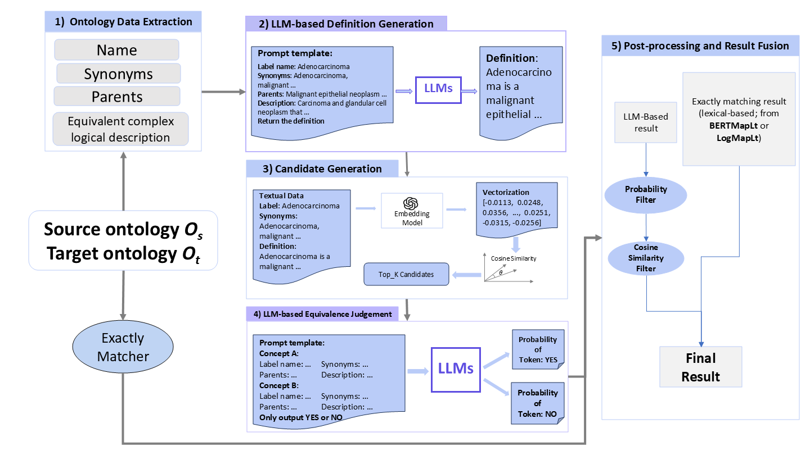

# GenOM Pipeline

This repository contains the official implementation of:

> **GenOM: Ontology Matching with Description Generation and Large Language Models**
> Published in *World Wide Web* (Springer), 2026.

GenOM is an ontology matching framework that improves alignment performance through **LLM-based semantic enrichment**, particularly via definition generation.

Paper:
- Published version (open access): https://doi.org/10.1007/s11280-026-01413-y
- Preprint: https://arxiv.org/abs/2508.10703

---

## Overview

GenOM is designed to address the limitations of traditional ontology matching methods that rely primarily on internal ontology information.
It introduces semantic enrichment using LLM-generated definitions, which enhances concept representations and improves multiple stages of the matching pipeline.

GenOM was developed and evaluated on the OAEI Bio-ML biomedical ontology benchmarks, but nothing in the pipeline is hard-coded to biomedical data -- domain, ontology names, and matching thresholds are all configuration, not code (see [Configuration Reference](#configuration-reference)).

---

## Pipeline Overview



The workflow consists of six stages, each implemented as a standalone module under `genom_pipeline/steps/` and orchestrated by `run_pipeline()` in `genom_pipeline/pipeline.py`:

| # | Stage | Module | Reads | Writes | Requires |
|---|-------|--------|-------|--------|----------|
| 1 | Concept extraction | `steps/extract.py` | `.owl` ontologies | `concept_store.pt` | DeepOnto (Java/JVM) |
| 2 | Definition generation | `steps/define.py` | `concept_store.pt` | `concept_store.pt` (+`definition`) | a local HF causal LM (`llm_model`) |
| 3 | Embedding | `steps/embed.py` | `concept_store.pt` | `concept_store.pt` (+`embedding`) | OpenAI Embeddings API |
| 4 | Candidate retrieval | `steps/retrieve.py` | `concept_store.pt` | `candidates_top{k}.csv` | FAISS |
| 5 | Equivalence judgement | `steps/judge.py` | `concept_store.pt` + candidates | `llm_alignment.csv` | a local HF causal LM (`llm_model`) |
| 6 | Fusion | `steps/fusion.py` | `llm_alignment.csv` (+ optional exact matcher) | `final_alignment.csv` | nothing extra (optionally an exact matcher, see below) |

Every intermediate artifact is written to `workdir` and is skipped on re-run unless `overwrite=True`, so a failed or interrupted run can simply be re-invoked with the same arguments to resume from the last completed stage (steps 1, 4, 5 and 6 check the output file; step 2 and 3 check per-concept whether a `definition`/`embedding` value already exists).

A seventh, optional stage lives outside `run_pipeline()`: `genom_pipeline/evaluation/` scores a `final_alignment.csv` against a gold-standard reference and can sweep threshold combinations without re-running steps 2-5. See [Evaluation](#evaluation).

---

## Repository Structure

    genom_pipeline/
    ├── __init__.py            # exposes run_pipeline, PipelineResult
    ├── pipeline.py             # orchestrates steps 1-6
    ├── steps/
    │   ├── extract.py          # stage 1
    │   ├── define.py           # stage 2
    │   ├── embed.py             # stage 3
    │   ├── retrieve.py         # stage 4
    │   ├── judge.py             # stage 5
    │   └── fusion.py             # stage 6
    ├── exact_matcher/
    │   ├── bertmaplt_string.py   # runs BERTMap-Lt's string matcher in-process (DeepOnto)
    │   ├── logmaplt_file.py       # loads a mapping TSV from a LogMap run you already did
    │   └── logmaplt_subprocess.py # actually invokes the LogMap jar (see scripts/download_logmap.sh)
    └── evaluation/
        └── metrics.py            # precision/recall/F1 + threshold grid search (not part of run_pipeline)

    scripts/
    └── download_logmap.sh        # fetches the LogMap standalone jar at setup time (not vendored in git)

    tests/                        # pytest suite, run in CI (see .github/workflows/ci.yml)
    docs/
    └── GenOM_workflow.png

---

## Installation

    git clone https://github.com/AlanS87/genom-pipeline.git
    cd genom-pipeline
    pip install -e .
    # or, to also get the test tooling:
    pip install -e ".[dev]"

### Prerequisites

- **Python 3.9+** (CI runs 3.10 and 3.11)
- **Java (JDK)** -- DeepOnto wraps the OWL API via a JVM, so a JDK must be on `PATH` for stage 1 (`extract`) and the `bertmaplt_string` exact matcher. `scripts/download_logmap.sh` / the `logmaplt_subprocess` matcher also shell out to `java` directly if you use LogMap.
- **`OPENAI_API_KEY`** -- stage 3 (`embed`) calls the OpenAI Embeddings API. Set the environment variable, or pass `embed_config={"api_key": "..."}`.
- **A GPU is strongly recommended** for stages 2 and 5 -- both load a real Hugging Face causal LM locally via `transformers` (`device_map="auto"`), not a hosted API. Gated models need `llm_config={"hf_token": "..."}`.
- **FAISS** -- `faiss-cpu` is installed by default; pass `retrieve_config={"index_params": {"use_gpu": True}}` if you have `faiss-gpu` installed separately.
- **LogMap standalone jar** -- only needed if you use the `logmaplt_subprocess` or `logmaplt_file` exact matchers. Not vendored in this repo (it's a large third-party binary) -- fetch it with `scripts/download_logmap.sh`, see [Exact Matching](#exact-matching).

---

## Quick Start

```python
from genom_pipeline import run_pipeline

result = run_pipeline(
    src_onto_path="path/to/source.owl",
    tgt_onto_path="path/to/target.owl",
    workdir="runs/example",
    llm_model="Qwen/Qwen2.5-14B-Instruct",
    embedding_model="text-embedding-3-small",
    llm_config={
        "domain": "legal",                    # any domain, not just biomedical -- see below
        "source_ontology_name": "SourceOnto",
        "target_ontology_name": "TargetOnto",
    },
)

print(result.final_alignment_csv)
```

`OPENAI_API_KEY` must be set in the environment before calling `run_pipeline` (or pass `embed_config={"api_key": "..."}`).

---

## Minimum required arguments

`run_pipeline()` has three required, no-default arguments -- everything else has a default or is optional:

- `src_onto_path`, `tgt_onto_path` -- paths to the two `.owl` files you want to align.
- `workdir` -- where all intermediate and final output files are written.

Beyond that, whether an argument is *effectively* required depends on which stages you actually run:

- `llm_model` is required if `run_definition=True` (the default -- stage 2 needs it) and is always required for stage 5 (`judge`), since `run_pipeline()` always runs judge. In practice: always pass it.
- `embedding_model` is required for stage 3 (`embed`), which `run_pipeline()` always runs. In practice: always pass it, and make sure `OPENAI_API_KEY` is set.
- `fuse_config` is entirely optional. If you don't pass `fuse_config={"exact": {...}}`, stage 6 simply skips exact matching and the final alignment is the LLM's own (thresholded, 1-to-1) predictions -- you do not need LogMap or BERTMap-Lt set up to get a first result.
- `llm_config`, `embed_config`, `retrieve_config` are all optional and fall back to the defaults documented below.

So the smallest realistic first call is exactly the Quick Start example above, minus `llm_config` if you're fine with the generic (non-domain-specialised) prompt.

---

## Configuration Reference

Every stage takes a plain `dict` of options rather than a config file. All keys below are optional unless noted; defaults are what the code uses when a key is omitted.

### `llm_config` (shared by stage 2 `define` and stage 5 `judge`)

| Key | Default | Meaning |
|---|---|---|
| `domain` | `"general"` | Fills the LLM's persona: `"You are an ontology expert specialising in the {domain} domain."` Any string works -- `"legal"`, `"finance"`, `"biomedical"`, etc. `"general"` (or omitting the key) uses a generic ontology-expert persona instead. |
| `source_ontology_name`, `target_ontology_name` | `None` | Human-readable ontology names woven into the prompt ("...from the {source_ontology_name} ontology..."). Purely cosmetic context for the LLM; has no effect on file paths. |
| `hf_token` | `None` | Hugging Face access token, needed for gated models. |
| `generation` (stage 2 only) | `{"max_new_tokens": 256, "do_sample": True, "temperature": 0.7, "top_p": 0.9}` | Forwarded to `model.generate()` for definition generation. |
| `batch_size` (stage 5 only) | `16` | Candidate pairs judged per forward pass. |
| `torch_dtype` (stage 5 only) | `"bfloat16"` | dtype the judge model is loaded in. |
| `device_map` (stage 5 only) | `"auto"` | Forwarded to `from_pretrained`. |
| `threshold` (stage 5 only) | `0.5` | **Not the same as `fuse_config["llm_threshold"]`** -- this only decides the `decision` column (YES/NO) written into `llm_alignment.csv`. `fuse_config["llm_threshold"]` (default `0.9`) is a stricter, separate filter applied afterwards in stage 6. Both `score` (cosine similarity) and `confidence` (the raw YES-probability) are preserved in `llm_alignment.csv` regardless of this threshold, so stage 6 (or `evaluation.grid_search_thresholds`) can re-filter without re-running the LLM. |

### `embed_config` (stage 3)

| Key | Default | Meaning |
|---|---|---|
| `api_key` | `os.environ["OPENAI_API_KEY"]` | OpenAI API key. |
| `text_fields` | `("label", "synonyms", "definition")` | Which concept fields get concatenated into the embedding input text. |
| `lowercase` | `True` | Lowercase text before embedding. |
| `join_synonyms`, `join_parents` | `True`, `True` | Join as one `"synonyms: a, b, c"` clause vs. appending each item separately. |
| `batch_size` | `64` | Concepts embedded per API call. |
| `max_tokens` | `8000` | Per-text truncation limit (via `tiktoken`), to avoid API token-limit errors. |
| `checkpoint_dir` | `{workdir}/checkpoints` | Embeddings are checkpointed here and resumed automatically if the run is interrupted. |

### `retrieve_config` (stage 4)

| Key | Default | Meaning |
|---|---|---|
| `normalize` | `True` | L2-normalize embeddings before indexing (so `score` is cosine similarity, not raw inner product). |
| `index_type` | `"hnsw"` | `"flatip"` (exact), `"ivf"`, or `"hnsw"` (approximate). |
| `index_params` | `{}` | Index-specific: `use_gpu`/`gpu_id`; IVF: `nlist`, `nprobe`; HNSW: `m`, `ef_construction`, `ef_search`. |

### `fuse_config` (stage 6)

| Key | Default | Meaning |
|---|---|---|
| `strategy` | `"exact_priority"` | `"exact_priority"` / `"union"` (currently identical -- both put exact-matcher rows first) or `"llm_then_exact_fill"` (LLM rows win conflicts, exact matcher only fills srcs the LLM didn't cover). |
| `llm_threshold` | `0.9` | Minimum `confidence` (LLM YES-probability) to keep a candidate. |
| `cs_threshold` | `0.9` | Minimum `score` (cosine similarity, from stage 4) to keep a candidate. Set to `None` to disable. |
| `enforce_target_uniqueness` | `True` | Also enforce that each target concept is used at most once (a true 1-to-1 alignment), not just each source concept. |
| `use_llm_rank1_only` | `True` | Only the best-ranked surviving candidate per source concept is kept. |
| `exact` | `None` | `{"name": "bertmaplt_string" \| "logmaplt_file" \| "logmaplt_subprocess", "config": {...}}`. Omit entirely to skip exact matching -- see [Exact Matching](#exact-matching) for each matcher's own config keys. |

Reproducing the paper's reported setup: `llm_threshold=0.9`, `cs_threshold=0.9` (already the defaults), `llm_model="Qwen/Qwen2.5-32B-Instruct"`, Bio-ML (OAEI) datasets. A single task is used for threshold selection and the same thresholds are applied across all tasks.

---

## Exact Matching

Stage 6 can optionally fuse the LLM's predictions with an exact/lexical matcher via `fuse_config["exact"]`. Three matchers are registered:

- **`bertmaplt_string`** -- runs BERTMap-Lt's string-matching module in-process via DeepOnto. `config`: `src_owl`, `tgt_owl` (required), `reasoner` (default `"elk"`), `pool_size` (default `200`), `apply_lowercasing` (default `True`).
- **`logmaplt_file`** -- loads a mapping TSV that some earlier, separate LogMap run already produced. `config`: `mapping_tsv` (required), `sep` (default `"\t"`), `has_header` (default `False`), `columns` (if `has_header`).
- **`logmaplt_subprocess`** -- actually invokes the LogMap jar (`LITE` mode) and parses its output, instead of assuming a TSV already exists. `config`: `src_owl`, `tgt_owl` (required), `jar_path` (or set the `LOGMAP_JAR_PATH` env var), `output_dir`, `java_bin` (default `"java"`), `jvm_args`, `timeout` (default `1800`s), `mapping_filename` (only needed if LogMap's output file can't be auto-detected), `sep`, `has_header`, `overwrite`.

LogMap itself (Apache License 2.0) is **not vendored in this repository** -- it's a large third-party Java tool with its own release cycle. Fetch it once with:

```bash
scripts/download_logmap.sh .cache/logmap <asset_download_url>
export LOGMAP_JAR_PATH=.cache/logmap/logmap-matcher-4.0.jar
```

(`<asset_download_url>` comes from the [official release page](https://github.com/ernestojimenezruiz/logmap-matcher/releases/tag/logmap-matcher-july-2021) -- GitHub's asset listing is JS-rendered, so the script asks for the link explicitly rather than guessing it.)

---

## Evaluation

`genom_pipeline.evaluation.metrics` is separate from `steps.fusion` on purpose: `fusion.run()` only produces predictions and has no notion of gold labels, so it stays usable in a real deployment where no reference alignment exists.

```python
from genom_pipeline.evaluation import metrics

# score an existing final_alignment.csv against a gold reference (OAEI-style TSV)
scores = metrics.evaluate_final_alignment(
    final_alignment_csv="runs/example/final_alignment.csv",
    reference_path="path/to/refs_equiv/full.tsv",
)
print(scores)  # {"precision": ..., "recall": ..., "f1": ..., ...}

# sweep (llm_threshold, cs_threshold) combinations directly on llm_alignment.csv,
# without re-running retrieval or the LLM judge
grid = metrics.grid_search_thresholds(
    llm_alignment_csv="runs/example/llm_alignment.csv",
    reference_path="path/to/refs_equiv/full.tsv",
    llm_thresholds=[0.5, 0.7, 0.9],
    cs_thresholds=[0.8, 0.9, 0.95],
)
print(metrics.best_thresholds(grid))
```

`metrics.plot_f1_heatmap(grid)` renders the same sweep as a heatmap, but requires `matplotlib`/`seaborn` (not core dependencies -- install them separately if you want it).

---

## Input

- Source ontology (`.owl`)
- Target ontology (`.owl`)

---

## Output

Results are stored in the specified `workdir`:

- `concept_store.pt` -- extracted concept data, generated definitions, and embeddings (all stages after 1 write back into this file)
- `candidates_top{k}.csv` -- top-k retrieval candidates (`src_iri, tgt_iri, score, rank`)
- `llm_alignment.csv` -- every judged candidate, with `confidence` and `decision` columns added
- `final_alignment.csv` -- the final alignment: `src_iri, tgt_iri, score, provenance`

Final mapping format: `(src_iri, tgt_iri)` pairs, at most one row per `src_iri` (and, by default, per `tgt_iri`).

---

## Reproducing Paper Results

To reproduce the experimental setup:

- Use Bio-ML datasets (OAEI)
- Cosine similarity threshold = 0.9
- LLM probability threshold = 0.9
- LLM: Qwen2.5-32B-Instruct

A single task is used for threshold selection, and the same thresholds are applied across all tasks. Both are already the defaults in `fuse_config` -- see [Configuration Reference](#configuration-reference).

---

## Key Design Principles

- Semantic enrichment improves representation rather than a single module
- Gains come from improvements across multiple pipeline stages
- Fixed thresholds are used to evaluate robustness

---

## Notes

- Missing ontology fields (e.g., synonyms, parents) are left empty
- Extraction is implemented using DeepOnto
- LLM outputs are used as semantic signals
- **DeepOnto compatibility patch**: DeepOnto's verbaliser (used by stage 1 to turn complex class expressions into natural language) does not support the OWL `DataHasValue` data property restriction, and crashes on any ontology that uses it -- SNOMED-CT being a real-world example. `genom_pipeline/_deeponto_compat.py` monkey-patches this at import time (applied automatically by `steps/extract.py`) to drop the unsupported sub-expression instead of crashing, emitting a `genom_pipeline._deeponto_compat.DataHasValueOmittedWarning` each time it happens so the information loss is visible rather than silent. This is a workaround for an upstream DeepOnto limitation, not a genom_pipeline design choice -- remove it once DeepOnto supports `DataHasValue` natively.
- **Non-interactive JVM startup**: DeepOnto starts a JVM (via `jpype`) the first time anything imports `deeponto.onto`, and will interactively prompt on stdin for how much memory to give it (`Please enter the maximum memory located to JVM`) unless the JVM is already running -- this blocks forever, and errors outright under pytest (`OSError: reading from stdin while output is captured!`), in any non-interactive context such as CI. `genom_pipeline/_deeponto_compat.py` starts the JVM itself, non-interactively, as soon as it's imported (before any `deeponto.onto` import anywhere in genom_pipeline), so the prompt never fires. The memory limit defaults to `8g` (DeepOnto's own default) and can be overridden with the `GENOM_JVM_MEMORY` environment variable, e.g. `GENOM_JVM_MEMORY=4g python your_script.py`.

---

## Limitations

- Focused on equivalence matching
- Not evaluated on tasks such as entity linking
- Performance depends on LLM choice

---

## Future Work

- Support subsumption relations
- Adaptive threshold selection
- Extend to other semantic matching tasks

---

## Citation

If you use this repository, please cite the published version:

    @article{song2026genom,
        title={GenOM: ontology matching with description generation and large language models},
        author={Song, Yiping and Chen, Jiaoyan and Schmidt, Renate A.},
        journal={World Wide Web},
        volume={29},
        number={3},
        articleno={29},
        year={2026},
        publisher={Springer},
        doi={10.1007/s11280-026-01413-y}
    }

A preprint version is also available on arXiv (arXiv:2508.10703); the published
version above is the canonical, peer-reviewed reference.

---

## Status

This repository is under active development.
Interfaces and configurations may change.
